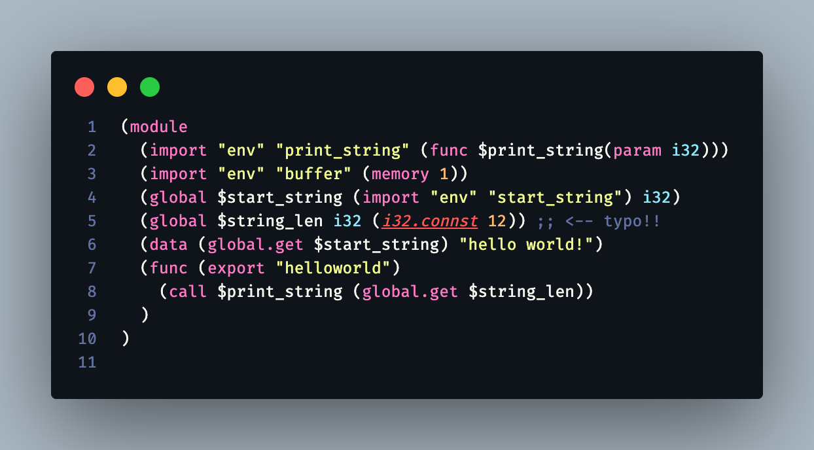

入門 WebAssembly https://www.shoeisha.co.jp/book/detail/9784798173597
（正誤表もあり）

資料
- Modules — WebAssembly 2.0 (Draft 2023-07-24) https://webassembly.github.io/spec/core/text/modules.html

## よく使うイディオム

```js
const fs = require('fs');
const basename = __filename.split(/[./]/).reverse()[1];
const bytes = fs.readFileSync(`${__dirname}/${basename}.wasm`);


(async () => {
  let obj = await WebAssembly.instantiate(
    new Uint8Array(bytes),
    importObject);

  xxxx_func = obj.instance.exports.xxxx_func;

  const xxxx_func_result = xxxx_func();
  // ...

})();
```


----------------------------------------

## Chapter 11

### [AssemblyScript for VSCode - Visual Studio Marketplace](https://marketplace.visualstudio.com/items?itemName=saulecabrera.asls)

AssemblyScript の LSP。検索するとこれ以外にも同様の拡張機能があるようだ。

リポジトリ https://github.com/Shopify/vscode-as は Public archive 状態になっている。

- `assembly/` フォルダ配下にあるファイルが対象になる。
- 上記は設定で変えられる。 設定キー： `asls.*`

### `asc` コマンド

`npm install -D assemblyscript` でグローバルではリポジトリに入れて `npx` 経由で使うようにした。

> -o の後に.wat ファイルの名前を指定すると WAT コードが生成され、.wasm ファイ ルの名前を指定すると WebAssembly バイナリモジュールが生成されます。

と本には書かれているが `npx asc as_add.ts -Oz -o as_add.wat` したらテキストファイルではなくバイナリファイルが生成された。

正しくは以下のとおり。

- `-t foo.wat` -> wat テキストをファイル出力
- `-o foo.wasm` -> wasm バイナリをファイル出力

この２つのオプションは同時に指定も可能。例えば、

```sh
$ npx asc as_add.ts -Oz -t as_add.wat -o as_add.wasm

$ ls as_add.*
as_add.ts   as_add.wasm as_add.wat

$ head -1 as_add.wat
(module

$ head -1 as_add.wasm
asm`AddIntsmemory
```


## Chapter 10

デバッガのコンソールに貼る用

```
$var0 // $x1: 0
$var1 // $y1: 1
$var2 // $x2: 4
$var3 // $y2: 4
$var4 // $x_dist: -4
$var5 // $y_dist:  5
```

## Chapter 3


### JS BigInt to Wasm i64 integration

[WebAssembly integration with JavaScript BigInt · V8](https://v8.dev/features/wasm-bigint)

> JavaScriptのNumbersはdouble、つまり64ビット浮動小数点値です。このような値には、あらゆる32ビット整数を完全な精度で含むことができますが、すべての64ビット整数を含むことができるわけではありません。一方、WebAssemblyは、i64型という64ビット整数を完全にサポートしています。例えば、Wasmの関数がi64を返す場合、JavaScriptからその関数を呼び出すと、VMは次のような例外を発生させる：
> ```
> TypeError: Wasm function signature contains illegal type
> ```


> WebAssembly BigIntの統合は、Chrome 85（2020-08-25リリース）を含む複数のブラウザで実装されていますので、今日からお試しください！

その他参考

- [Roadmap - WebAssembly](https://webassembly.org/roadmap/)
- [WebAssembly/JS-BigInt-integration: JavaScript BigInt to WebAssembly i64 integration](https://github.com/WebAssembly/JS-BigInt-integration)


### get と set 

- `local.get` や `global.get` : そのスコープから指定の値を取り出し、スタックに積む（プッシュする）。
- `local.set` や `global.set` : スタックから値を１つポップし（取り出し）、そのスコープにセットする。

**スタックの視点からみると get がプッシュで set がポップ。**


## Chapter 2

### Javascript の数値型

[JavaScriptの数値型完全理解 - Qiita](https://qiita.com/uhyo/items/f9abb94bcc0374d7ed23)

Javascript の数値型は、すべて 64 ビットの浮動小数点数で表現されている。
整数と小数が区別されているようで、されていない。

### .wasm ファイルを読み込むイディオム（Javascript側）

```js
const fs = require('fs');
const bytes = fs.readFileSync(__dirname + '/xxxxxxxx.wasm');
```

このイディオムは、次のようにすることで `xxxxxxxx` の部分を JS のファイル名から取得できるので毎度変更して書かなくてよくなる。

```js
const fs = require('fs');
const basename = __filename.split(/[./]/).reverse()[1];
const bytes = fs.readFileSync(`${__dirname}/${basename}.wasm`);
```


### [wasm 側の関数を呼び出すイディオム（Javascript側）

即時実行関数式 (IIFE) の最後の `()` を忘れがちなので注意。

```js
(async () => {
  let obj = await WebAssembly.instantiate(
    new Uint8Array(bytes),
    importObject);

  xxxx_func = obj.instance.exports.xxxx_func;

  const xxxx_func_result = xxxx_func();
  // ...

})();
```


## Chapter 1

### コンパイル環境

```
$ node -v
v19.8.1

$ npm -v
9.5.1


npm install -g wat-wasm


$ wat2wasm  

    Usage:
    wat2wasm file.wat
    Creates file.wasm given a WebAssembly Text file
  
    wat2wasm file.wat -o other.wasm
    Creates other.wasm WebAssembly file from file.wat.
      The -o flag allows you to specify an output file.
  
    Flags:
    -o is followed by an output file name);

    -O1 minimal performance optmization
    -O2 moderate performance optmization
    -O3 maximum performance optmization

    -Os minimal size optmization
    -Oz maximum size optmization

    --exceptions exception handling (proposal)
    --mutable-globals import/export mutable globals (proposal)
    --sat-float-to-int non-trapping float-to-int conversion (proposal)
    --sign-extension sign-extension operators (proposal)
    --sign-extension sign-extension operators (proposal)
    --simd single instruction multiple data (proposal)
    --threads threads (proposal)
    --multi-value functions may return more than one value (proposal)
    --tail-call tail call optimization (proposal)
    --bulk-memory bulk memory copy and memory move (proposal)
    --reference-types improved interoperablility with host env (proposal)
    --annotations custom annotations (proposal)
    --gc garbage collection (proposal)
```

### 実行例

```sh
$ wat2wasm AddInt.wat 

========================================================
  WAT2WASM
========================================================
  

  Need help?  
  Contact Rick Battagline
  Twitter: @battagline
  https://wasmbook.com
  v1.0.43
  
no memory
Writing to AddInt.wasm
WASM File Saved!

$ node AddInt.js 4 7
4 + 7 = 11

$ node AddInt.js 100 23
100 + 23 = 123

```


### エディタ環境

https://marketplace.visualstudio.com/items?itemName=dtsvet.vscode-wasm

> - Syntax highlight
> - Preview WebAssembly Binary files in 2 clicks.
> - Fast convertion between text and binary view.
> - Syntax highlight for WAI and WIT files.

ミスっている箇所を赤字で強調してくれるので分かりやすい。




### 最新の Instructions Set

たぶん v2.0 draft

https://webassembly.github.io/spec/core/appendix/index-instructions.html

